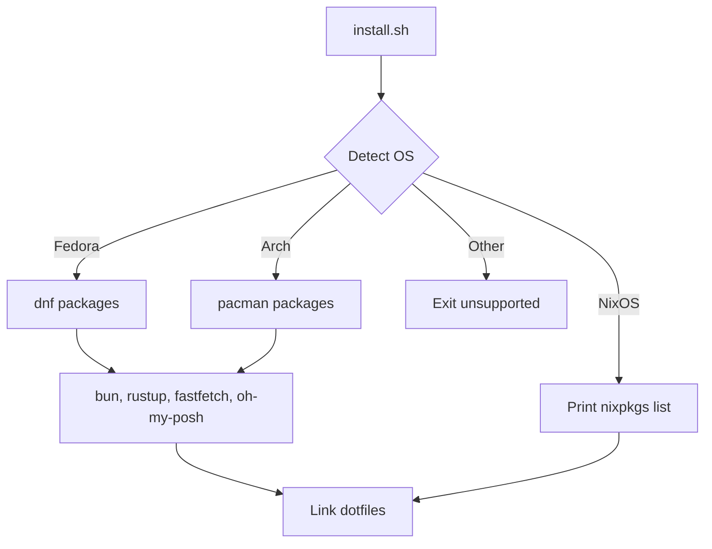

# myeow linux config

<p align="center">
  
</p>

Personal Linux dotfiles plus `install.sh`. The script detects Fedora,
Arch, or NixOS, installs the tools these configs expect, and installs
Kitty, zsh, Cursor, and Catppuccin Mocha GRUB.

Use it when you want this machine's shell, terminal, boot menu, and
Cursor skills reproduced on a supported distro without copying files
by hand. It provides:

* Distro detection for Fedora, Arch Linux, and NixOS
* Idempotent symlinks with timestamped backups
* Oh My Zsh plugins and Oh My Posh (Catppuccin Frappé prompt)
* Catppuccin Mocha GRUB theme
* bun, npm/npx, Rust, fastfetch, and JetBrainsMono Nerd Font

> [!CAUTION]
> This is a personal setup, published for viewing. It is not a
> general-purpose distro installer. Unsupported systems exit; NixOS
> does not get `dnf` or `pacman` installs.

## Tech stack

This repository uses the following technologies:

<p align="left">
  
  
  
  
  
  
  
  
  
</p>

## Features

* Detects the OS from `/etc/os-release` (and `/etc/NIXOS`).
* Installs Fedora packages with `dnf`, Arch packages with `pacman`.
* On NixOS, prints nixpkgs names to add before linking dotfiles.
* Links Kitty, `.zshrc`, and Cursor skill directories.
* Installs Oh My Posh with Catppuccin.
* Installs Catppuccin Mocha as the GRUB theme (Fedora/Arch).
* Installs Oh My Zsh plus autosuggestions, syntax highlighting, and
  completions.
* Skips work that is already done; safe to run again.



## Install

You need Fedora, Arch Linux, or NixOS, plus `git` and `curl` on the
PATH. Network access is required for Oh My Zsh, plugins, bun, rustup,
Oh My Posh, and the Nerd Font.

1. Copy this repository onto the machine.
2. Open a terminal in the repository root.
3. Make the installer executable and run it:

```bash
chmod +x install.sh
./install.sh
```

4. Open a new terminal, or run `exec zsh`.

Replaced files go to `~/.dotfiles-backup/<timestamp>/`.

### NixOS

`install.sh` does not install system packages on NixOS. Add the printed
names to `environment.systemPackages` or `home.packages`, set
`users.users.YOUR-USER.shell = pkgs.zsh;`, add
`pkgs.nerd-fonts.jetbrains-mono` to `fonts.packages`, then rebuild.
Dotfile symlinks still run.

## Quick start

Preview actions without changing the system:

```bash
./install.sh --dry-run
```

Link configs only, and skip packages, bun, rustup, and fastfetch:

```bash
./install.sh --skip-packages
```

## Configuration

`install.sh` accepts these options:

| Option | Description |
| --- | --- |
| `-h`, `--help` | Show this help |
| `--skip-packages` | Do not install system packages or toolchains |
| `--skip-fonts` | Do not install JetBrainsMono Nerd Font |
| `--skip-grub` | Do not install the GRUB theme |
| `--dry-run` | Print actions without changing the system |

Linked paths:

| Repository path | Destination |
| --- | --- |
| `dotfiles/kitty/` | `~/.config/kitty/` |
| `dotfiles/oh-my-zsh/.zshrc` | `~/.zshrc` |
| Catppuccin zsh theme | `~/.oh-my-zsh/custom/themes/` |
| `dotfiles/cursor/skills/` | `~/.cursor/skills` |
| `dotfiles/cursor/agents/skills/` | `~/.cursor/agents/skills` |
| `dotfiles/oh-my-posh/themes/catppuccin.omp.json` | `~/.config/oh-my-posh/themes/catppuccin.omp.json` |
| `dotfiles/grub/catppuccin-mocha-grub-theme/` | `/usr/share/grub/themes/catppuccin-mocha-grub-theme/` |

Kitty uses Catppuccin Frappé, JetBrainsMono Nerd Font at size 9, hidden
decorations, padding, and 0.85 background opacity. The prompt uses
Oh My Posh with Catppuccin (`ZSH_THEME=""`). GRUB uses
Catppuccin Mocha at `1920x1200,1920x1080,auto`.

On NixOS, `install.sh` does not write `/etc/default/grub`. Point
`boot.loader.grub.theme` at the mocha theme in this repo, then rebuild.

## Soon

This repo still treats NixOS as “print packages, then rebuild yourself.”
The next step is a flake so that machine is declared in-tree.

* Add a `flake.nix` with a `nixosConfigurations` (and later
  `homeConfigurations`) entry for this setup
* Move the current NixOS package list — zsh, Kitty, bun, rustup,
  fastfetch, fonts — into the flake instead of a printed hint
* Express Kitty, zsh, and Cursor skill paths as home-manager modules
  so NixOS does not rely on `install.sh` symlinks alone
* Use `nixos-rebuild switch --flake .#HOSTNAME` as the NixOS install
  path; keep Fedora and Arch on `install.sh`
* Pull Catppuccin from nixpkgs or a Catppuccin flake where a module
  already exists, including GRUB

Until that lands, `install.sh` on NixOS only links dotfiles.

## Layout

```text
.
├── install.sh
├── assets/
│   ├── banner.svg
│   └── kitty_fastfetch_screenshot.png
└── dotfiles/
    ├── kitty/
    ├── oh-my-zsh/
    ├── oh-my-posh/
    ├── grub/
    └── cursor/
        ├── skills/
        └── agents/skills/
```

## Screenshots


## Documentation

| Guide | Description |
| --- | --- |
| [install.sh](./install.sh) | Installer source and `--help` text |
| [kitty.conf](./dotfiles/kitty/kitty.conf) | Kitty appearance |
| [.zshrc](./dotfiles/oh-my-zsh/.zshrc) | Oh My Zsh, Oh My Posh, PATH, and fastfetch |
| [Oh My Posh theme](./dotfiles/oh-my-posh/themes/catppuccin.omp.json) | Catppuccin prompt |
| [GRUB default](./dotfiles/grub/default) | Theme and gfxmode used on this machine |

## Credits

Themes, plugins, and installers in this config come from these
projects:

| Project | Repository |
| --- | --- |
| Oh My Zsh | [ohmyzsh/ohmyzsh](https://github.com/ohmyzsh/ohmyzsh) |
| Catppuccin for zsh | [JannoTjarks/catppuccin-zsh](https://github.com/JannoTjarks/catppuccin-zsh) |
| Catppuccin for Kitty | [catppuccin/kitty](https://github.com/catppuccin/kitty) |
| Catppuccin for GRUB | [catppuccin/grub](https://github.com/catppuccin/grub) |
| zsh-autosuggestions | [zsh-users/zsh-autosuggestions](https://github.com/zsh-users/zsh-autosuggestions) |
| zsh-syntax-highlighting | [zsh-users/zsh-syntax-highlighting](https://github.com/zsh-users/zsh-syntax-highlighting) |
| zsh-completions | [zsh-users/zsh-completions](https://github.com/zsh-users/zsh-completions) |
| Nerd Fonts | [ryanoasis/nerd-fonts](https://github.com/ryanoasis/nerd-fonts) |
| fastfetch | [fastfetch-cli/fastfetch](https://github.com/fastfetch-cli/fastfetch) |
| Bun | [oven-sh/bun](https://github.com/oven-sh/bun) |
| Oh My Posh | [JanDeDobbeleer/oh-my-posh](https://github.com/JanDeDobbeleer/oh-my-posh) |
| rustup | [rust-lang/rustup](https://github.com/rust-lang/rustup) |

Cursor skills in `dotfiles/cursor/` are bundled from their own
upstreams where those are recorded, including
[JuliusBrussee/caveman](https://github.com/JuliusBrussee/caveman) and
[robzolkos/skill-rails-upgrade](https://github.com/robzolkos/skill-rails-upgrade).

## License

This repository does not include a license file.
