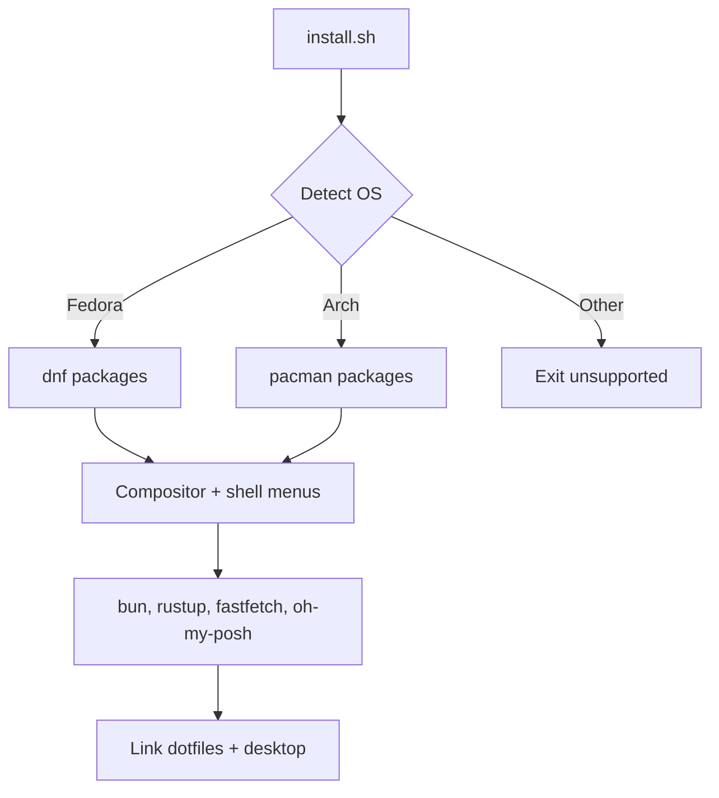

# myeow linux config

<p align="center">
  
</p>

Personal Linux dotfiles plus `install.sh`. The script detects Fedora or
Arch, installs the tools these configs expect, and installs Kitty, zsh,
Cursor, Oh My Posh, and Catppuccin Mocha GRUB. Interactively (or via
flags) it can also install a Wayland compositor, an optional desktop
shell, New Wave Rofi, and Catppuccin Mocha SDDM.

Use it when you want this machine's shell, terminal, boot menu, desktop,
and Cursor skills reproduced on a supported distro without copying files
by hand. It provides:

* Distro detection for Fedora and Arch Linux
* Idempotent symlinks with timestamped backups
* Oh My Zsh plugins and Oh My Posh (Catppuccin prompt)
* Catppuccin Mocha GRUB theme
* Optional Wayland rice: Sway / Niri / Hyprland plus Noctalia,
  DankMaterialShell, Caelestia, or compositor-only
* bun, npm/npx, Rust, fastfetch, and JetBrainsMono Nerd Font

> [!CAUTION]
> This is a personal setup, published for viewing. It is not a
> general-purpose distro installer. Unsupported systems exit.

## Tech stack

This repository uses the following technologies:

<p align="left">
  
  
  
  
  
  
  
  
</p>

## Features

* Detects the OS from `/etc/os-release`.
* Installs Fedora packages with `dnf`, Arch packages with `pacman`.
* Links Kitty, `.zshrc`, Oh My Posh theme, and Cursor skill directories.
* Installs Oh My Posh with Catppuccin.
* Installs Catppuccin Mocha as the GRUB theme.
* Offers a Catppuccin-styled compositor menu (Sway, Niri, Hyprland) and
  desktop shell menu (Noctalia, Material, Celestial, None).
* Links New Wave Rofi, installs Catppuccin Mocha SDDM, and writes a
  shell autostart snippet for the chosen compositor.
* Installs Oh My Zsh plus autosuggestions, syntax highlighting, and
  completions.
* Skips work that is already done; safe to run again.



## Install

You need Fedora or Arch Linux, plus `git` and `curl` on the PATH.
Network access is required for Oh My Zsh, plugins, bun, rustup,
Oh My Posh, and the Nerd Font.

1. Copy this repository onto the machine.
2. Open a terminal in the repository root.
3. Make the installer executable and run it:

```bash
chmod +x install.sh
./install.sh
```

4. Answer the compositor and desktop shell prompts (or pass flags).
5. Open a new terminal, or run `exec zsh`. Log in through SDDM for a
   Wayland session when you enabled the desktop path.

Replaced files go to `~/.dotfiles-backup/<timestamp>/`.

## Desktop choices

On an interactive terminal, after OS detection, `install.sh` shows two
numbered menus (skipped when the matching flag is set):

1. **Compositor** — `1` Sway (default), `2` Niri, `3` Hyprland
2. **Desktop shell** — `1` Noctalia, `2` Material (DankMaterialShell),
   `3` Celestial (Caelestia), `4` None

It then confirms compositor, shell, and whether to enable SDDM (default
yes). Shell names map to upstream projects (not zsh):

| Choice | Upstream |
| --- | --- |
| `noctalia` | [noctalia-dev/noctalia-shell](https://github.com/noctalia-dev/noctalia-shell) |
| `material` | [AvengeMedia/DankMaterialShell](https://github.com/AvengeMedia/DankMaterialShell) |
| `celestial` | [caelestia-dots/shell](https://github.com/caelestia-dots/shell) |
| `none` | Compositor only (Sway keeps the New Wave config and distro bar) |

Pass `--skip-desktop` for today’s terminal-only install (no compositor,
shell, Rofi, or SDDM).

## Quick start

Preview actions without changing the system:

```bash
./install.sh --dry-run
```

Non-interactive desktop preview:

```bash
./install.sh --dry-run --compositor sway --shell none
```

Link configs only, and skip packages, bun, rustup, and fastfetch:

```bash
./install.sh --skip-packages
```

Terminal-only (no Wayland rice):

```bash
./install.sh --skip-desktop
```

## Configuration

`install.sh` accepts these options:

| Option | Description |
| --- | --- |
| `-h`, `--help` | Show this help |
| `--skip-packages` | Do not install system packages or toolchains |
| `--skip-fonts` | Do not install JetBrainsMono Nerd Font |
| `--skip-grub` | Do not install the GRUB theme |
| `--skip-desktop` | Terminal-only install (no compositor / shell / SDDM) |
| `--compositor sway\|niri\|hyprland` | Skip the compositor menu |
| `--shell noctalia\|material\|celestial\|none` | Skip the shell menu |
| `--no-sddm` | Install desktop pieces but do not enable SDDM |
| `--dry-run` | Print actions without changing the system |

Linked paths:

| Repository path | Destination |
| --- | --- |
| `dotfiles/kitty/` | `~/.config/kitty/` |
| `dotfiles/oh-my-zsh/.zshrc` | `~/.zshrc` |
| Catppuccin zsh theme | `~/.oh-my-zsh/custom/themes/` |
| `dotfiles/cursor/skills/` | `~/.cursor/skills` |
| `dotfiles/cursor/agents/skills/` | `~/.cursor/agents/skills` |
| `dotfiles/oh-my-posh/themes/catppuccin.omp.json` | `~/.oh-my-posh/themes/catppuccin.omp.json` |
| `dotfiles/grub/catppuccin-mocha-grub-theme/` | `/usr/share/grub/themes/catppuccin-mocha-grub-theme/` |
| `dotfiles/sway/config` | `~/.config/sway/config` |
| `dotfiles/niri/config.kdl` | `~/.config/niri/config.kdl` |
| `dotfiles/hypr/hyprland.conf` | `~/.config/hypr/hyprland.conf` |
| `dotfiles/rofi/` | `~/.config/rofi` |
| `dotfiles/sddm/catppuccin-mocha/` | `/usr/share/sddm/themes/catppuccin-mocha/` (copied) |
| `dotfiles/sddm/sddm.conf.d/10-catppuccin.conf` | `/etc/sddm.conf.d/10-catppuccin.conf` (copied) |

Kitty uses Catppuccin Frappé, JetBrainsMono Nerd Font at size 9, hidden
decorations, padding, and 0.85 background opacity. The prompt uses
Oh My Posh with Catppuccin (`ZSH_THEME=""`). GRUB uses
Catppuccin Mocha at `1920x1200,1920x1080,auto`.

Use a Nerd Font in every terminal that shows the prompt (Kitty and
Cursor’s integrated terminal both need `JetBrainsMono Nerd Font`).

## Soon

* More Oh My Posh theme variants under `dotfiles/oh-my-posh/themes/`
* Optional Cursor `settings.json` snippet for the Nerd Font terminal
* Trim unused Cursor skills from the install set

## Layout

```text
.
├── install.sh
├── assets/
│   ├── banner.svg
│   └── kitty_fastfetch_screenshot.png
└── dotfiles/
    ├── kitty/
    ├── oh-my-zsh/
    ├── oh-my-posh/
    ├── grub/
    ├── sway/
    ├── niri/
    ├── hypr/
    ├── rofi/
    ├── sddm/
    └── cursor/
        ├── skills/
        └── agents/skills/
```

## Screenshots


## Documentation

| Guide | Description |
| --- | --- |
| [install.sh](./install.sh) | Installer source and `--help` text |
| [kitty.conf](./dotfiles/kitty/kitty.conf) | Kitty appearance |
| [.zshrc](./dotfiles/oh-my-zsh/.zshrc) | Oh My Zsh, Oh My Posh, PATH, and fastfetch |
| [Oh My Posh theme](./dotfiles/oh-my-posh/themes/catppuccin.omp.json) | Catppuccin prompt |
| [GRUB default](./dotfiles/grub/default) | Theme and gfxmode used on this machine |
| [Sway config](./dotfiles/sway/config) | New Wave–based Sway starter |
| [Rofi](./dotfiles/rofi/) | New Wave Rofi launchers and applets |

## Credits

Themes, plugins, and installers in this config come from these
projects:

| Project | Repository |
| --- | --- |
| Oh My Zsh | [ohmyzsh/ohmyzsh](https://github.com/ohmyzsh/ohmyzsh) |
| Catppuccin for zsh | [JannoTjarks/catppuccin-zsh](https://github.com/JannoTjarks/catppuccin-zsh) |
| Catppuccin for Kitty | [catppuccin/kitty](https://github.com/catppuccin/kitty) |
| Catppuccin for GRUB | [catppuccin/grub](https://github.com/catppuccin/grub) |
| Catppuccin for SDDM | [catppuccin/sddm](https://github.com/catppuccin/sddm) |
| New Wave (Sway + Rofi) | [LoneWolf4713/new-wave](https://github.com/LoneWolf4713/new-wave) |
| Noctalia | [noctalia-dev/noctalia-shell](https://github.com/noctalia-dev/noctalia-shell) |
| DankMaterialShell | [AvengeMedia/DankMaterialShell](https://github.com/AvengeMedia/DankMaterialShell) |
| Caelestia shell | [caelestia-dots/shell](https://github.com/caelestia-dots/shell) |
| zsh-autosuggestions | [zsh-users/zsh-autosuggestions](https://github.com/zsh-users/zsh-autosuggestions) |
| zsh-syntax-highlighting | [zsh-users/zsh-syntax-highlighting](https://github.com/zsh-users/zsh-syntax-highlighting) |
| zsh-completions | [zsh-users/zsh-completions](https://github.com/zsh-users/zsh-completions) |
| Nerd Fonts | [ryanoasis/nerd-fonts](https://github.com/ryanoasis/nerd-fonts) |
| fastfetch | [fastfetch-cli/fastfetch](https://github.com/fastfetch-cli/fastfetch) |
| Bun | [oven-sh/bun](https://github.com/oven-sh/bun) |
| Oh My Posh | [JanDeDobbeleer/oh-my-posh](https://github.com/JanDeDobbeleer/oh-my-posh) |
| rustup | [rust-lang/rustup](https://github.com/rust-lang/rustup) |

Cursor skills in `dotfiles/cursor/` are bundled from their own
upstreams where those are recorded, including
[JuliusBrussee/caveman](https://github.com/JuliusBrussee/caveman) and
[robzolkos/skill-rails-upgrade](https://github.com/robzolkos/skill-rails-upgrade).

## License

This repository does not include a license file.
