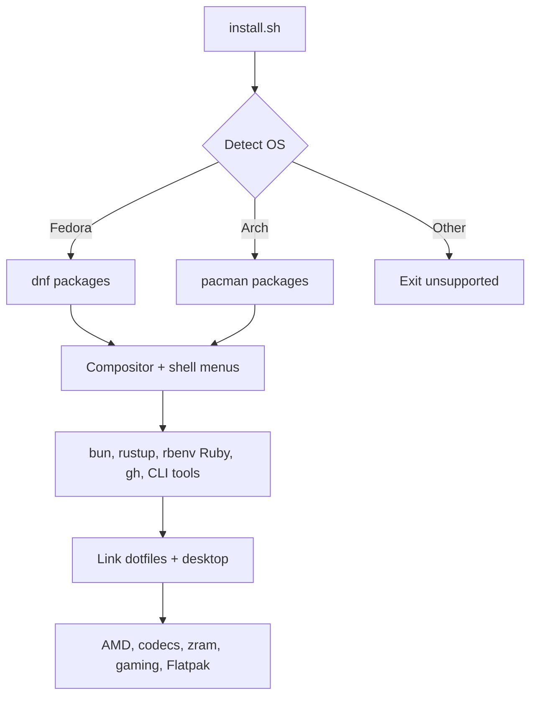
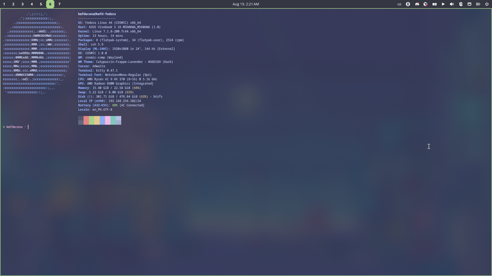

# myeow linux config

<p align="center">
  
</p>

<p align="center">
  <a href="https://github.com/kmfd14/myeow-linux-config"></a>
  <a href="https://github.com/kmfd14/myeow-linux-config/stargazers"></a>
  <a href="https://github.com/kmfd14/myeow-linux-config/issues"></a>
</p>

Personal Linux dotfiles plus `install.sh`. The script detects Fedora or Arch,
installs the tools these configs expect (Kitty, zsh, Cursor, Oh My Posh,
Catppuccin Mocha GRUB), and can install a Wayland compositor, desktop shell,
New Wave Rofi, and Catppuccin Mocha SDDM.

Use it when you want this machine's shell, terminal, boot menu, desktop, and
Cursor skills reproduced on a supported distro without copying files by hand.

It provides:

* Distro detection for Fedora and Arch Linux
* Idempotent symlinks with timestamped backups
* Oh My Zsh, Oh My Posh (Catppuccin), Catppuccin Mocha GRUB
* Optional Wayland rice: SwayFX / Niri / Hyprland plus Noctalia,
  DankMaterialShell, Caelestia, or compositor-only (`shell=none` + waybar)
* Dev toolchain: bun, npm/npx, Rust, Ruby 4.0.2 (rbenv), `gh`,
  ripgrep / fd / fzf / jq / tmux, JetBrainsMono Nerd Font

> [!CAUTION]
> This is a personal setup, published for viewing. It is not a
> general-purpose distro installer. Unsupported systems exit.

## Navigate

| Goal | Go here |
| --- | --- |
| Install on this machine | [Install](#install) |
| Preview without changing anything | [Quick start](#quick-start) |
| Pick compositor / shell / launcher | [Desktop](#desktop) |
| Laptop keys, power, printers | [Laptop controls](#laptop-controls) |
| Ruby, `gh`, CLI search tools | [Dev tools](#dev-tools) |
| Flags and linked paths | [Configuration](#configuration) |
| Deeper file guides | [Documentation](#documentation) |

## Tech stack

<p align="left">
  
  
  
  
  
  
  
  
  
  
</p>

## Features

**Install flow**

* Detects OS from `/etc/os-release` (Fedora → `dnf`, Arch → `pacman`)
* Idempotent: safe to re-run; backups under `~/.dotfiles-backup/<timestamp>/`
* Interactive menus or flags for compositor, shell, launcher, SDDM

**Desktop**

* SwayFX (default), Niri, or Hyprland; Noctalia / Material / Celestial / none
* Super+Space launcher (Rofi or Noctalia); Super+w opens Brave Flatpak
* PipeWire, portals, polkit, Thunar+gvfs, CUPS, lid→suspend, waybar when
  `shell=none`

**Dev**

* bun, Rust (rustup), Ruby 4.0.2 via rbenv + build deps
* GitHub CLI (`gh`), ripgrep, fd, fzf, jq, tmux
* Cursor (official script), VS Code / Sublime / DBeaver Flatpaks

**Hardware and apps**

* AMD Mesa / Vulkan / VA-API when an AMD GPU is detected
* zram (half RAM, zstd) and power-profiles-daemon (not TLP)
* Flatpaks including Proton Pass, Proton VPN, Brave, and the rest listed below



## Install

You need Fedora or Arch, with `git` and `curl` on PATH. Network is required for
Oh My Zsh, plugins, bun, rustup, Oh My Posh, Ruby build, and the Nerd Font.

1. Clone or copy this repository onto the machine.
2. Open a terminal in the repository root.
3. Run:

```bash
chmod +x install.sh
./install.sh
```

4. Answer compositor / shell / launcher prompts (or pass [flags](#configuration)).
5. Apply the shell: `exec zsh` (or open a new terminal).
6. For Wayland + SDDM: log out and sign in again (or reboot if GRUB / zram /
   lid rules need it).

Replaced files go to `~/.dotfiles-backup/<timestamp>/`.

After install:

```bash
gh auth login
ruby -v          # expect 4.0.2 via rbenv
```

## Quick start

Preview without changing the system (~30 seconds):

```bash
./install.sh --dry-run
```

Desktop dry-run with flags:

```bash
./install.sh --dry-run --compositor sway --shell none
./install.sh --dry-run --compositor sway --shell noctalia --launcher noctalia
```

Configs only (no packages / toolchains):

```bash
./install.sh --skip-packages
```

Terminal-only (no Wayland rice / Flatpak apps):

```bash
./install.sh --skip-desktop --skip-apps
```

## Desktop

Interactive menus (skipped when the matching flag is set):

1. Compositor — `1` SwayFX (default), `2` Niri, `3` Hyprland
2. Desktop shell — `1` Noctalia, `2` Material, `3` Celestial, `4` None
3. App launcher (Noctalia shell only) — `1` Rofi, `2` Noctalia built-in

Confirm compositor, shell, launcher, and SDDM (default yes).
**Super** is the Windows key (`Mod4`). **Super+w** opens Brave
(`flatpak run com.brave.Browser`).

| Choice | Upstream |
| --- | --- |
| `noctalia` | [noctalia-dev/noctalia-shell](https://github.com/noctalia-dev/noctalia-shell) |
| `material` | [AvengeMedia/DankMaterialShell](https://github.com/AvengeMedia/DankMaterialShell) |
| `celestial` | [caelestia-dots/shell](https://github.com/caelestia-dots/shell) |
| `none` | Compositor only: mako, nm-applet, blueman-applet, **waybar** |

### Desktop plumbing

When the desktop path runs (unless `--skip-packages`):

* PipeWire + WirePlumber, `pavucontrol`, `blueman`, `upower`
* `polkit-gnome` (Sway session autostart)
* `xdg-desktop-portal-gtk` plus `xdg-desktop-portal-wlr` (Sway/Niri) or
  `xdg-desktop-portal-hyprland` (Hyprland)
* Thunar helpers: `gvfs`, `tumbler`, `thunar-volman`, `thunar-archive-plugin`
* Noto Sans + emoji, `gnome-keyring`, `imv`, `gnome-calculator`
* MIME defaults via `dotfiles/xdg/mimeapps.list`
* Lid → suspend: `/etc/systemd/logind.conf.d/10-myeow-laptop.conf`
* CUPS + Avahi; `shell=none` also gets **waybar**

### Laptop controls

| Action | How |
| --- | --- |
| Brightness | Fn keys / `brightnessctl set 5%+` |
| Output volume / mute | Fn keys / `wpctl` on `@DEFAULT_AUDIO_SINK@` |
| Mic mute | Fn mic mute / `wpctl set-mute @DEFAULT_AUDIO_SOURCE@ toggle` |
| Speakers / mic / BT audio | Super+A → pavucontrol |
| Power profile | Super+Shift+P or `powerprofilesctl set …` |
| Suspend / reboot / power off | Super+X Rofi powermenu |
| Lock / idle | Super+L; swayidle 5m lock / 10m DPMS |
| Lid close | suspend (logind drop-in) |
| Battery | waybar / shell UI, or `upower` |
| Printers | `system-config-printer` or http://localhost:631 |

Power management uses **power-profiles-daemon** only (not TLP or auto-cpufreq).

Noctalia can show power profiles in its bar. Charge-limit UI needs a community
plugin **and** sysfs `charge_control_end_threshold` on your laptop.

### SwayFX rice

Sway installs **SwayFX** (not stock Sway): end-4–inspired look (corners, blur,
shadows, dim inactive), Windows-like tiling. Visual reference only — end-4
Quickshell is not ported. Config: `dotfiles/sway/` (`config` + `config.d/`).

Screenshots: Super+Shift+s (region), Print (full) via `grim` / `slurp`.

Pass `--skip-desktop` for a terminal-only install.

## Dev tools

| Tool | Notes |
| --- | --- |
| GitHub CLI | `gh` (Fedora) / `github-cli` (Arch) → `gh auth login` |
| Search / session | `rg`, `fd`, `fzf`, `jq`, `tmux` |
| Build helpers | `gcc`, `make`, `pkgconf`, Ruby compile deps |

### Ruby (rbenv)

Installer runs build deps + `ruby-build`, then:

```bash
rbenv install 4.0.2
rbenv global 4.0.2
```

Skips compile if `4.0.2` is already installed. First run needs network and can
take several minutes. `.zshrc` already has `eval "$(rbenv init -)"`.

## Hardware, codecs, gaming, and apps

These always run after the desktop path (unless `--skip-packages`):

### AMD GPU

If `lspci` shows AMD/Radeon display (including Radeon 890M), installs Mesa,
Vulkan, VA-API/VDPAU helpers, and firmware. GRUB sets `amdgpu.gttsize=8192`.
ROCm is not installed.

### Video codecs

* Fedora: RPM Fusion free + nonfree, then ffmpeg + GStreamer plugins
* Arch: `ffmpeg`, `gst-plugins-*`, `gst-libav`, `libva`

### Performance

* `zram-generator`: `zram-size = ram / 2`, `zstd`
* `power-profiles-daemon` enabled

### Printing (CUPS)

CUPS, filters, cups-browsed, `system-config-printer`, Avahi; enables `cups` and
`avahi-daemon`.

### Gaming

Native `gamemode`, `gamescope`, **Steam** (not Flatpak). Launch:

```bash
gamemoderun gamescope -- steam
```

### cloudflared

Cloudflare tunnel client (Fedora RPM repo or GitHub binary; Arch pacman or
binary). Does **not** create or login a tunnel:

```bash
cloudflared tunnel login
cloudflared tunnel run <your-tunnel-name>
```

### Flatpak apps

Flathub apps: Brave, VS Code, LibreOffice, VLC, Jellyfin Server, DBeaver,
Discord, Obsidian, qBittorrent, Spotify, Telegram, Zoom, GIMP, OBS,
KDE Connect, PeaZip, Sublime Text, Proton Pass, Proton VPN.

**Podman** is native. **Cursor** uses the official install script when missing.

`--skip-apps` skips only Flatpak / Cursor.

## Configuration

| Option | Description |
| --- | --- |
| `-h`, `--help` | Show help |
| `--skip-packages` | Skip system packages and toolchains |
| `--skip-fonts` | Skip JetBrainsMono Nerd Font |
| `--skip-grub` | Skip GRUB theme |
| `--skip-desktop` | No compositor / shell / SDDM |
| `--compositor sway\|niri\|hyprland` | Skip compositor menu (`sway` → SwayFX) |
| `--shell noctalia\|material\|celestial\|none` | Skip shell menu |
| `--launcher rofi\|noctalia` | Launcher; `noctalia` only with Noctalia shell |
| `--no-sddm` | Desktop pieces without enabling SDDM |
| `--skip-apps` | Skip Flathub apps and Cursor script |
| `--dry-run` | Print actions only |

### Linked paths

| Repository path | Destination |
| --- | --- |
| `dotfiles/kitty/` | `~/.config/kitty/` |
| `dotfiles/oh-my-zsh/.zshrc` | `~/.zshrc` |
| Catppuccin zsh theme | `~/.oh-my-zsh/custom/themes/` |
| `dotfiles/cursor/skills/` | `~/.cursor/skills` |
| `dotfiles/cursor/agents/skills/` | `~/.cursor/agents/skills` |
| `dotfiles/oh-my-posh/themes/catppuccin.omp.json` | `~/.oh-my-posh/themes/catppuccin.omp.json` |
| `dotfiles/grub/catppuccin-mocha-grub-theme/` | `/usr/share/grub/themes/…/` |
| `dotfiles/sway/config` + `config.d/` | `~/.config/sway/` |
| `wallpapers/lofi-japanese-…jpg` | `~/.config/sway/wallpaper.jpg` |
| `dotfiles/niri/config.kdl` | `~/.config/niri/config.kdl` |
| `dotfiles/hypr/hyprland.conf` | `~/.config/hypr/hyprland.conf` |
| `dotfiles/rofi/` | `~/.config/rofi` |
| `dotfiles/sddm/catppuccin-mocha/` | `/usr/share/sddm/themes/…/` (copied) |
| `dotfiles/sddm/sddm.conf.d/10-catppuccin.conf` | `/etc/sddm.conf.d/…` (copied) |
| `dotfiles/xdg/mimeapps.list` | `~/.config/mimeapps.list` |
| `scripts/cycle-power-profile.sh` | `~/.local/bin/cycle-power-profile.sh` |
| `dotfiles/waybar/` (`shell=none`) | `~/.config/waybar/` |

Kitty: Catppuccin Frappé, JetBrainsMono Nerd Font size 9, opacity 0.85.
Prompt: Oh My Posh Catppuccin (`ZSH_THEME=""`). GRUB: Catppuccin Mocha at
`1920x1200,1920x1080,auto`. Use that Nerd Font in Kitty and Cursor’s terminal.

### Layout

```text
.
├── install.sh
├── scripts/
│   └── cycle-power-profile.sh
├── assets/
│   ├── banner.svg
│   └── kitty_fastfetch_screenshot.png
├── wallpapers/
└── dotfiles/
    ├── kitty/  oh-my-zsh/  oh-my-posh/  grub/
    ├── sway/config.d/  niri/  hypr/  rofi/  waybar/
    ├── sddm/  xdg/
    └── cursor/skills/  cursor/agents/skills/
```

## Screenshots



<!-- VISUAL SUGGESTION [SCREENSHOT]:
Add a SwayFX desktop screenshot after the Kitty shot.
Show tiled windows, Catppuccin borders, and (if shell=none) waybar.
Purpose: Show the Wayland rice landing state after ./install.sh.
-->

## Documentation

| Guide | Description |
| --- | --- |
| [install.sh](./install.sh) | Installer source and `--help` |
| [kitty.conf](./dotfiles/kitty/kitty.conf) | Kitty appearance |
| [.zshrc](./dotfiles/oh-my-zsh/.zshrc) | Oh My Zsh, Oh My Posh, PATH |
| [Oh My Posh theme](./dotfiles/oh-my-posh/themes/catppuccin.omp.json) | Catppuccin prompt |
| [GRUB default](./dotfiles/grub/default) | Theme and gfxmode |
| [SwayFX config](./dotfiles/sway/config) | Modular SwayFX rice |
| [Rofi](./dotfiles/rofi/) | New Wave launchers and applets |

## Roadmap

* More Oh My Posh theme variants under `dotfiles/oh-my-posh/themes/`
* Optional Cursor `settings.json` snippet for the Nerd Font terminal
* Trim unused Cursor skills from the install set

## Contributing

This is a personal config. Useful changes still welcome:

1. Fork the repository
2. Create a feature branch
3. Open a pull request against [kmfd14/myeow-linux-config](https://github.com/kmfd14/myeow-linux-config)

## Credits

| Project | Repository |
| --- | --- |
| Oh My Zsh | [ohmyzsh/ohmyzsh](https://github.com/ohmyzsh/ohmyzsh) |
| Catppuccin for zsh | [JannoTjarks/catppuccin-zsh](https://github.com/JannoTjarks/catppuccin-zsh) |
| Catppuccin for Kitty | [catppuccin/kitty](https://github.com/catppuccin/kitty) |
| Catppuccin for GRUB | [catppuccin/grub](https://github.com/catppuccin/grub) |
| Catppuccin for SDDM | [catppuccin/sddm](https://github.com/catppuccin/sddm) |
| New Wave (Rofi) | [LoneWolf4713/new-wave](https://github.com/LoneWolf4713/new-wave) |
| SwayFX | [WillPower3309/swayfx](https://github.com/WillPower3309/swayfx) |
| end-4 dots (inspiration) | [end-4/dots-hyprland](https://github.com/end-4/dots-hyprland) |
| Noctalia | [noctalia-dev/noctalia-shell](https://github.com/noctalia-dev/noctalia-shell) |
| DankMaterialShell | [AvengeMedia/DankMaterialShell](https://github.com/AvengeMedia/DankMaterialShell) |
| Caelestia shell | [caelestia-dots/shell](https://github.com/caelestia-dots/shell) |
| zsh-autosuggestions | [zsh-users/zsh-autosuggestions](https://github.com/zsh-users/zsh-autosuggestions) |
| zsh-syntax-highlighting | [zsh-users/zsh-syntax-highlighting](https://github.com/zsh-users/zsh-syntax-highlighting) |
| zsh-completions | [zsh-users/zsh-completions](https://github.com/zsh-users/zsh-completions) |
| Nerd Fonts | [ryanoasis/nerd-fonts](https://github.com/ryanoasis/nerd-fonts) |
| fastfetch | [fastfetch-cli/fastfetch](https://github.com/fastfetch-cli/fastfetch) |
| Bun | [oven-sh/bun](https://github.com/oven-sh/bun) |
| Oh My Posh | [JanDeDobbeleer/oh-my-posh](https://github.com/JanDeDobbeleer/oh-my-posh) |
| rustup | [rust-lang/rustup](https://github.com/rust-lang/rustup) |

Cursor skills in `dotfiles/cursor/` keep their own upstreams where recorded,
including [JuliusBrussee/caveman](https://github.com/JuliusBrussee/caveman) and
[robzolkos/skill-rails-upgrade](https://github.com/robzolkos/skill-rails-upgrade).

## License

This repository does not include a license file.
